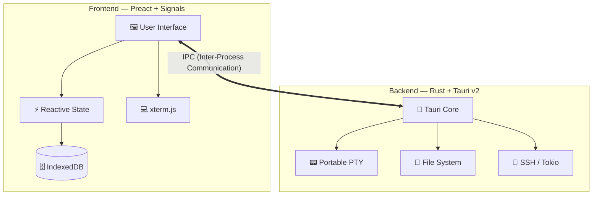

<div align="center">


# NightFlow

### _Your experiments. Your hardware. Your flow._

A premium, native desktop application for professional deep-learning\
experiment management, visualization, and auto-training in computer vision.

[](LICENSE)
[](https://v2.tauri.app)
[](https://preactjs.com)
[](https://www.rust-lang.org)

[Features](#-features) · [Quick Start](#-quick-start) · [Architecture](#-architecture) · [Download](#-download) · [Contributing](#-contributing)

---

</div>

## ✨ Why NightFlow?

Deep-learning research should be **fluid and focused**. NightFlow brings order to the chaos of local and remote experiment management with a beautiful, high-performance **native** interface.

| | |
| :--- | :--- |
| 🔒 **Private by Design** | Your datasets and weights never leave your hardware. No cloud accounts, no telemetry—ever. |
| ⚡ **Native Performance** | Built with **Rust** and **Tauri v2** for a lightweight, snappy experience—no Electron bloat. |
| 🔗 **Unified Workflow** | Manage projects, track metrics, and run remote training via SSH—all in one place. |

---

## 🚀 Features

<table>
<tr>
<td width="50%" valign="top">

### 📁 Organize & Track
- **Project Hub** — Create structured ML projects with dedicated configs
- **Experiment Tracking** — Real-time metric logs and run history
- **Project Dashboard** — Instant health overview and status cards

</td>
<td width="50%" valign="top">

### 📊 Visualize & Analyze
- **Interactive Charts** — High-fidelity loss and accuracy plots
- **Deep Interpretation** — Integrated model analysis tools
- **Netron Inside** — Visual architecture inspector built-in

</td>
</tr>
<tr>
<td width="50%" valign="top">

### 🖥️ Connect & Run
- **Pro Terminal** — Full xterm.js PTY with WebGL acceleration
- **SSH Mastery** — One-click remote server management
- **Native Tooling** — Direct filesystem and process interaction

</td>
<td width="50%" valign="top">

### 🛡️ Built with Trust
- **100% Offline** — Zero internet dependency
- **No Telemetry** — We don't track you. Period.
- **Local Storage** — Data persists in IndexedDB on your device

</td>
</tr>
</table>

---

## 🏗️ Architecture

NightFlow leverages a modern, dual-layer architecture for maximum efficiency and safety.



<details>
<summary><b>Tech Stack at a Glance</b></summary>
<br>

| Layer | Technology | Purpose |
| :--- | :--- | :--- |
| **UI Framework** | Preact + Signals | Lightweight reactive rendering |
| **Terminal** | xterm.js + WebGL addon | Hardware-accelerated terminal |
| **Styling** | Vanilla CSS | Custom design system |
| **Bundler** | Vite | Fast HMR and builds |
| **Desktop Runtime** | Tauri v2 | Native window, IPC, and system APIs |
| **Backend Language** | Rust (Edition 2024) | Memory-safe, high-performance core |
| **PTY** | portable-pty | Cross-platform pseudo-terminal |
| **Async Runtime** | Tokio | Non-blocking I/O and SSH |
| **Storage** | IndexedDB | Client-side persistent storage |

</details>

---

## 🏁 Quick Start

### Prerequisites

| Requirement | Version |
| :--- | :--- |
| **Node.js** | 22+ |
| **Bun** | Latest |
| **Rust** | Stable (Edition 2024) |

### Setup

```bash
# 1 · Clone the repository
git clone https://github.com/theja-vanka/NightFlow.git && cd NightFlow

# 2 · Install dependencies
npm install --legacy-peer-deps

# 3 · Launch in developer mode
npx tauri dev
```

> [!TIP]
> **First run** may take a few minutes while Rust compiles the backend. Subsequent builds are incremental and fast.

### Development Scripts

| Command | Description |
| :--- | :--- |
| `npm run dev` | Start Vite dev server (frontend only) |
| `npm run build` | Build frontend for production |
| `npx tauri dev` | Launch full app in dev mode |
| `npx tauri build` | Build distributable binaries |
| `npm run lint` | Lint source with ESLint |

---

## 📦 Download

| Platform | Arch | Format |
| :--- | :--- | :--- |
| 🍎 **macOS** | ARM64 / x64 | `.dmg` |
| 🪟 **Windows** | x64 | `.exe` |
| 🐧 **Linux** | x64 | `.AppImage` |

> [!TIP]
> Grab the latest build from the **[Releases](../../releases/latest)** page.

---

## 🤝 Contributing

Contributions, issues, and feature requests are welcome! Feel free to check the [issues page](../../issues).

1. **Fork** the repository
2. **Create** a feature branch (`git checkout -b feat/amazing-feature`)
3. **Commit** your changes (`git commit -m 'feat: add amazing feature'`)
4. **Push** to the branch (`git push origin feat/amazing-feature`)
5. **Open** a Pull Request

---

## 📄 License

Distributed under the **Apache License 2.0**. See [`LICENSE`](LICENSE) for details.

---

<div align="center">

**Built with 🖤 by [Krishnatheja Vanka](https://github.com/theja-vanka)**

<sub>If you found NightFlow useful, consider giving it a ⭐ on GitHub!</sub>

</div>
