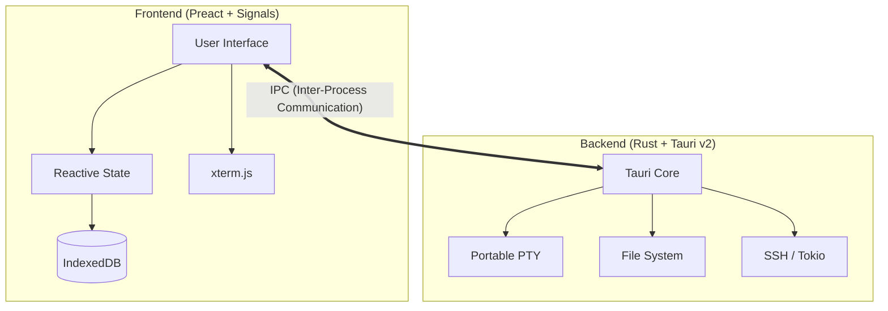

<div align="center">


# 🌌 NightFlow

**A premium, native desktop application for professional deep-learning experiment management.**

[](LICENSE)
[](https://v2.tauri.app/)
[](https://www.rust-lang.org/)
[](https://preactjs.com/)

[✨ Features](#-features) • [🚀 Quick Start](#-quick-start) • [🏗️ Architecture](#️-architecture) • [📦 Download](#-download)

---

</div>

## 💡 Why NightFlow?

Deep learning research should be fluid and focused. **NightFlow** brings order to the chaos of local and remote experiment management with a beautiful, high-performance native interface.

- **Private by Design**: Your datasets and weights never leave your hardware. No cloud accounts, no telemetry.
- **Native Performance**: Built with Rust and Tauri for a lightweight, snappy experience—no Electron bloat.
- **Unified Workflow**: Manage projects, track metrics, and run remote training via SSH, all in one place.

## ✨ Features

<table width="100%">
<tr>
<td width="50%" valign="top">

### 📋 Organize & Track
- **Project Hub**: Create structured ML projects with dedicated configs.
- **Experiment Tracking**: Real-time metric logs and run history.
- **Project Dashboard**: Instant health overview and status cards.

</td>
<td width="50%" valign="top">

### 📊 Visualize & Analyze
- **Interactive Charts**: High-fidelity loss and accuracy plots.
- **Deep Interpretation**: Integrated model analysis tools.
- **Netron Inside**: Visual architecture inspector built-in.

</td>
</tr>
<tr>
<td width="50%" valign="top">

### 🖥️ Connect & Run
- **Pro Terminal**: Full xterm.js PTY with WebGL acceleration.
- **SSH Mastery**: One-click remote server management.
- **Native Tooling**: Direct filesystem and process interaction.

</td>
<td width="50%" valign="top">

### 🔒 Built with Trust
- **100% Offline**: Zero internet dependency.
- **No Telemetry**: We don't track you. Ever.
- **Local Storage**: Data persists in IndexedDB on your device.

</td>
</tr>
</table>

## 🏗️ Architecture

NightFlow leverages a modern, dual-layer architecture for maximum efficiency and safety.



## 🚀 Quick Start

### Prerequisites

| Node.js | Bun | Rust |
| :---: | :---: | :---: |
| 22+ | Latest | Stable |

### Setup

```bash
# Clone the repository
git clone https://github.com/theja-vanka/NightFlow.git && cd NightFlow

# Install dependencies
npm install --legacy-peer-deps

# Launch in developer mode
npx tauri dev
```

## 📦 Download

| Platform | Arch | Format |
| :--- | :--- | :--- |
| **macOS** | ARM64 / x64 | `.dmg` |
| **Windows** | x64 | `.exe` |
| **Linux** | x64 | `.AppImage` |

> [!TIP]
> Get the latest builds from the **[Releases](../../releases/latest)** page.

## 🛠️ Development Scripts

```bash
npm run dev        # Start Vite dev server
npm run build      # Build frontend
npx tauri dev      # Launch app in dev mode
npx tauri build    # Build distributable apps
```

---

<div align="center">
    <b>Built with ❤️ by <a href="https://github.com/theja-vanka">Krishnatheja Vanka</a></b><br/>
    <sub>Released under the Apache License 2.0</sub>
</div>
