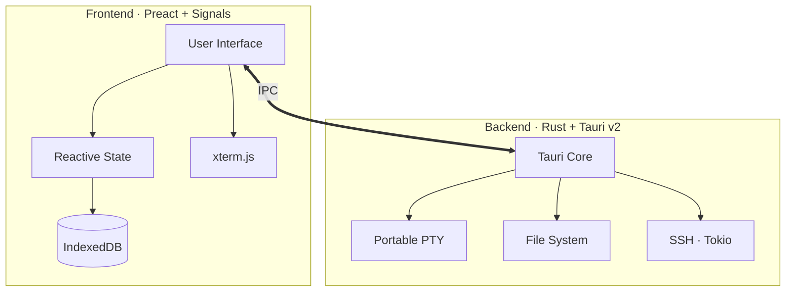

<div align="center">


### _Your experiments. Your hardware. Your flow._

A premium, native desktop application for professional deep-learning<br>
experiment management, visualization, and auto-training in computer vision.

<br>

[](LICENSE)
[]()
[](../../stargazers)
[](../../issues)
[](../../pulls)
[](../../commits)


[](https://v2.tauri.app)
[](https://www.rust-lang.org)
[](https://preactjs.com)
[](https://vitejs.dev)
[]()
[](https://tokio.rs)

<br>

[Features](#features) · [Architecture](#architecture) · [Quick Start](#quick-start) · [Download](#download) · [Contributing](#contributing)

</div>

<br>

## Why NightFlow?

Deep-learning research should be **fluid and focused**. NightFlow brings order to the chaos of local and remote experiment management with a beautiful, high-performance **native** interface.

| | |
| :--- | :--- |
| **Private by Design** | Your datasets and weights never leave your hardware. No cloud accounts, no telemetry — ever. |
| **Native Performance** | Built with **Rust** and **Tauri v2** for a lightweight, snappy experience — no Electron bloat. |
| **Unified Workflow** | Manage projects, track metrics, and run remote training via SSH — all in one place. |

<br>

## Features

<table>
<tr>
<td width="50%" align="center">
<br>
<b>Organize & Track</b>
<br><br>
<code>Project Hub</code> · Structured ML projects with dedicated configs<br>
<code>Experiment Tracking</code> · Real-time metric logs and full run history<br>
<code>Project Dashboard</code> · Instant health overview and status cards
<br><br>
</td>
<td width="50%" align="center">
<br>
<b>Visualize & Analyze</b>
<br><br>
<code>Interactive Charts</code> · High-fidelity loss and accuracy plots<br>
<code>Deep Interpretation</code> · Integrated model analysis tools<br>
<code>Netron Inside</code> · Visual architecture inspector built-in
<br><br>
</td>
</tr>
<tr>
<td width="50%" align="center">
<br>
<b>Connect & Run</b>
<br><br>
<code>Pro Terminal</code> · Full xterm.js PTY with WebGL acceleration<br>
<code>SSH Mastery</code> · One-click remote server management<br>
<code>Native Tooling</code> · Direct filesystem and process interaction
<br><br>
</td>
<td width="50%" align="center">
<br>
<b>Built with Trust</b>
<br><br>
<code>100% Offline</code> · Zero internet dependency<br>
<code>No Telemetry</code> · We don't track you. Period.<br>
<code>Local Storage</code> · Data persists in IndexedDB on your device
<br><br>
</td>
</tr>
</table>

<br>

## Architecture

NightFlow leverages a modern, dual-layer architecture for maximum efficiency and safety.



<details>
<summary><b>Tech Stack at a Glance</b></summary>
<br>

| Layer | Technology | Purpose |
| :--- | :--- | :--- |
| **UI Framework** | Preact + Signals | Lightweight reactive rendering |
| **Terminal** | xterm.js + WebGL addon | Hardware-accelerated terminal |
| **Styling** | Vanilla CSS | Custom design system |
| **Bundler** | Vite | Fast HMR and builds |
| **Desktop Runtime** | Tauri v2 | Native window, IPC, and system APIs |
| **Backend Language** | Rust (Edition 2024) | Memory-safe, high-performance core |
| **PTY** | portable-pty | Cross-platform pseudo-terminal |
| **Async Runtime** | Tokio | Non-blocking I/O and SSH |
| **Storage** | IndexedDB | Client-side persistent storage |

</details>

<br>

## Quick Start

### Prerequisites

| Requirement | Version |
| :--- | :--- |
| **Node.js** | 22 + |
| **Bun** | Latest |
| **Rust** | Stable (Edition 2024) |

### Setup

```bash
# Clone the repository
git clone https://github.com/theja-vanka/NightFlow.git && cd NightFlow
```

<table>
<tr>
<td width="50%">

#### Using npm

```bash
# Install dependencies
npm install --legacy-peer-deps

# Launch in developer mode
npx tauri dev
```

</td>
<td width="50%">

#### Using Bun

```bash
# Install dependencies
bun install

# Launch in developer mode
bunx tauri dev
```

</td>
</tr>
</table>

> [!TIP]
> **First run** may take a few minutes while Rust compiles the backend. Subsequent builds are incremental and fast.

### Development Scripts

| Action | npm | Bun |
| :--- | :--- | :--- |
| Start Vite dev server | `npm run dev` | `bun run dev` |
| Build frontend | `npm run build` | `bun run build` |
| Launch full app (dev) | `npx tauri dev` | `bunx tauri dev` |
| Build distributables | `npx tauri build` | `bunx tauri build` |
| Lint source | `npm run lint` | `bun run lint` |

<br>

## Download

| Platform | Arch | Format |
| :--- | :--- | :--- |
| **macOS** | ARM64 / x64 | `.dmg` |
| **Windows** | x64 | `.exe` |
| **Linux** | x64 | `.AppImage` |

> [!TIP]
> Grab the latest build from the **[Releases](../../releases/latest)** page.

<br>

## Contributing

Contributions, issues, and feature requests are welcome. Feel free to check the [issues page](../../issues).

1. **Fork** the repository
2. **Create** a feature branch — `git checkout -b feat/amazing-feature`
3. **Commit** your changes — `git commit -m 'feat: add amazing feature'`
4. **Push** to the branch — `git push origin feat/amazing-feature`
5. **Open** a Pull Request

<br>

## License

Distributed under the **Apache License 2.0**. See [`LICENSE`](LICENSE) for details.

---

<div align="center">
<br>

**Built by [Krishnatheja Vanka](https://github.com/theja-vanka)**

<sub>If you find NightFlow useful, consider giving it a star on GitHub.</sub>

<br>
</div>
