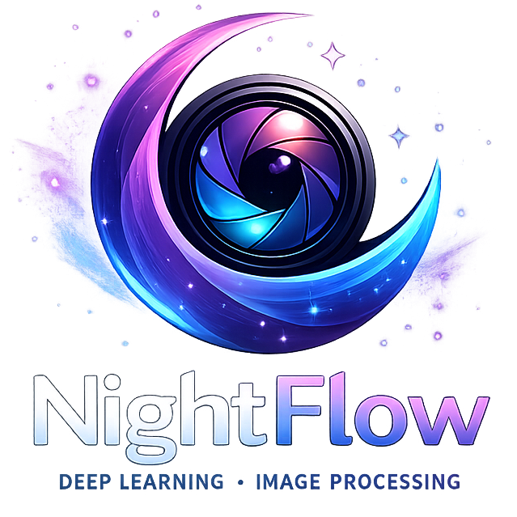
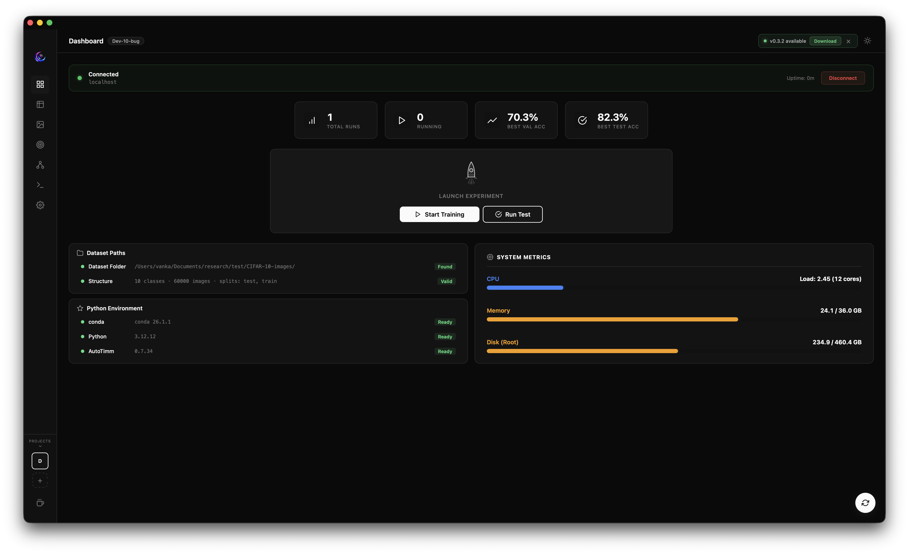
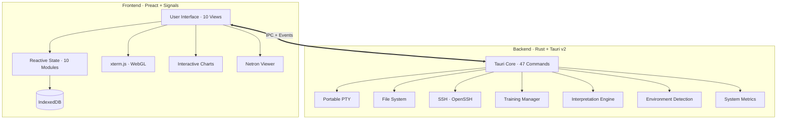

<div align="center">

<br>



<br>

### Train, manage, and interpret image models — on your own terms.

The open-source desktop alternative to AWS Rekognition Custom Labels,
Google AutoML Vision, and Azure Custom Vision.

<br>

[](LICENSE)
[]()
[](../../stargazers)
[](../../issues)
[](../../pulls)
[](../../commits)

<br>


-x64-FCC624?style=for-the-badge&logo=linux&logoColor=black)

<br>

[](https://v2.tauri.app)
[](https://www.rust-lang.org)
[](https://preactjs.com)
[](https://vitejs.dev)

<br>

[Overview](#-overview) · [Features](#-features) · [How It Compares](#-how-it-compares) · [Quick Start](#-quick-start) · [Download](#-download) · [Architecture](#-architecture) · [Docs](https://theja-vanka.github.io/NightFlow/) · [Contributing](#-contributing) · [License](#-license)

<br>



<br>

</div>

<!-- ------------------------------------------------------------------ -->

## Overview

**NightFlow** is a **native desktop application** purpose-built for **automated deep learning on images**. It wraps a complete image-model training pipeline — from dataset ingestion and augmentation through training, metric visualization, and model export — inside a fast, privacy-first interface that runs entirely on your own hardware.

Whether you're training an image classifier, an object detector, or a segmentation model, NightFlow handles:

- **Automated model training** with auto-tuning of learning rate and batch size
- **Full experiment lifecycle management** — project organization, run history, metric tracking, and comparison
- **Model interpretation & explainability** — GradCAM, Integrated Gradients, Attention Rollout, and more
- **Remote GPU training via SSH** — run jobs on powerful servers without leaving the app
- **Production export** — TorchScript, ONNX, and TensorRT output, plus direct Hugging Face Hub deployment

> **No cloud accounts. No per-hour charges. No data leaving your machine.**

---

## How It Compares

| | Cloud AutoML | NightFlow |
| :--- | :---: | :---: |
| **Data privacy** | Images uploaded to third-party servers | Data never leaves your device |
| **Cost** | $3 – $5+ per training hour, plus inference fees | Free and open-source |
| **Vendor lock-in** | Proprietary formats, cloud-only deployment | Export to TorchScript, ONNX, TensorRT — deploy anywhere or push to Hugging Face Hub |
| **Transparency** | Black-box training, limited tuning | Full control: 1 000+ backbones, every hyperparameter |
| **Internet** | Required | Works completely offline |
| **Experiment mgmt** | External tooling needed | Built-in charts, run history, and comparison |

---

## Features

<table>
<tr>
<td width="50%" valign="top">

### Auto Deep Learning

- **One-click training** — guided project wizard from raw images to trained model
- **Auto-tuning** — automatic learning-rate and batch-size discovery
- **1 000+ backbones** — ResNet, EfficientNet, ViT, ConvNeXt, Swin, and more via timm
- **Augmentation preview** — visualize augmentation presets before training
- **Training queue** — queue multiple training jobs for sequential execution
- **Multi-task** — classification, object detection, semantic & instance segmentation

</td>
<td width="50%" valign="top">

### Experiment Management

- **Project hub** — organize datasets, configs, and runs per project
- **Real-time metrics** — live loss, accuracy, and custom metric streams
- **Run history** — searchable table of every experiment with hyperparameters
- **Run comparison** — side-by-side metric charts across experiments
- **Dashboard** — instant project health overview and status cards
- **Inference** — run predictions on new images with trained models

</td>
</tr>
<tr>
<td width="50%" valign="top">

### Visualization & Interpretation

- **Interactive charts** — high-fidelity training and validation plots
- **Model interpretation** — GradCAM, GradCAM++, Integrated Gradients, SmoothGrad, Attention Rollout, Attention Flow
- **Confusion matrix** — per-class performance breakdown for train, validation, and test splits
- **Per-class metrics** — detailed precision, recall, and F1 scores per class
- **Dataset browser** — visual explorer with class-level filtering and split detection
- **Netron integration** — built-in architecture visualization

</td>
<td width="50%" valign="top">

### Infrastructure & Deployment

- **Integrated terminal** — full PTY with WebGL-accelerated rendering
- **Remote training via SSH** — train on GPU servers using system OpenSSH
- **System metrics** — live CPU, memory, and GPU utilization (NVIDIA)
- **Model export** — TorchScript (.pt), ONNX (.onnx), and TensorRT (.engine) for production
- **Hugging Face Hub** — push models directly to HF Hub with model card metadata
- **Checkpoint management** — best-model selection and remote download
- **Crash recovery** — automatic training session recovery after unexpected exits

</td>
</tr>
</table>

<table>
<tr>
<td width="100%" align="center">

### Private by Design

All data stays on your device. No cloud accounts, no telemetry, no tracking.
Storage is local IndexedDB. The entire application works offline.

### First-Run Experience

Built-in tutorial overlay, keyboard shortcuts reference, and a guided project wizard
to get new users productive in minutes.

</td>
</tr>
</table>

---

## Who Is It For?

| Audience | Value |
| :--- | :--- |
| **Data Scientists & ML Engineers** | Stop paying per training hour. Run unlimited experiments on your own GPU with full hyperparameter control, real-time streaming metrics, and built-in model interpretation. |
| **Startups & Small Teams** | Get the AutoML experience of enterprise cloud platforms without cloud bills. The guided project wizard takes you from raw images to a deployable model — no code required. |
| **Researchers** | Reproducible experiments with configurable seeds, deterministic training, full run history, and side-by-side comparison — all in a fast native app. |
| **Privacy-Sensitive Orgs** | Healthcare, defense, finance — any domain where data cannot leave the organization. NightFlow processes everything locally. |

---

## Architecture

NightFlow is built with **Tauri v2** (Rust) and **Preact** — delivering native performance at a fraction of the footprint of Electron-based alternatives.



<details>
<summary><b>Tech Stack</b></summary>
<br>

| Layer | Technology | Purpose |
| :--- | :--- | :--- |
| **UI Framework** | Preact + Signals | Lightweight reactive rendering |
| **Terminal** | xterm.js + WebGL addon | Hardware-accelerated terminal |
| **Model Viewer** | Netron | Neural network architecture visualization |
| **Styling** | Vanilla CSS | Custom design system |
| **Bundler** | Vite 7 | Fast HMR and builds |
| **Desktop Runtime** | Tauri v2 | Native window, IPC, and system APIs |
| **Backend** | Rust (Edition 2024) | Memory-safe, high-performance core |
| **PTY** | portable-pty | Cross-platform pseudo-terminal |
| **SSH** | System OpenSSH | Remote training and file operations |
| **Async Runtime** | Tokio | Non-blocking I/O and process management |
| **Storage** | IndexedDB (idb) | Client-side persistent storage |

</details>

---

## Quick Start

### Prerequisites

| Requirement | Version |
| :--- | :--- |
| **Node.js** | 22+ |
| **Bun** | Latest |
| **Rust** | Stable (Edition 2024) |

> [!NOTE]
> **Debian / Ubuntu** — install Tauri system dependencies first:
> ```bash
> sudo apt-get update && sudo apt-get install -y \
>   libwebkit2gtk-4.1-dev libappindicator3-dev librsvg2-dev \
>   patchelf libgtk-3-dev libsoup-3.0-dev libjavascriptcoregtk-4.1-dev
> ```

### Setup

```bash
git clone https://github.com/theja-vanka/NightFlow.git && cd NightFlow
```

<table>
<tr>
<td width="50%">

#### npm

```bash
npm install --legacy-peer-deps
npx tauri dev
```

</td>
<td width="50%">

#### Bun

```bash
bun install
bunx tauri dev
```

</td>
</tr>
</table>

> [!TIP]
> **First run** may take a few minutes while Rust compiles the backend. Subsequent launches are incremental and fast.

### Development Commands

| Action | npm | Bun |
| :--- | :--- | :--- |
| Frontend dev server | `npm run dev` | `bun run dev` |
| Build frontend | `npm run build` | `bun run build` |
| Launch full app | `npx tauri dev` | `bunx tauri dev` |
| Build distributables | `npx tauri build` | `bunx tauri build` |
| Lint | `npm run lint` | `bun run lint` |

---

## Download

| Platform | Architecture | Formats |
| :--- | :--- | :--- |
| **macOS** | ARM64 / x64 | `.dmg` |
| **Windows** | x64 | `.exe` (NSIS) |
| **Linux** | x64 | `.deb` · `.AppImage` |

> [!TIP]
> Download the latest release from the **[Releases](../../releases/latest)** page.

### Homebrew (macOS)

```bash
brew tap theja-vanka/nightflow https://github.com/theja-vanka/NightFlow
brew install --cask nightflow
```

---

## Documentation

Full documentation is available at **[theja-vanka.github.io/NightFlow](https://theja-vanka.github.io/NightFlow/)** — covering architecture, getting started, and contribution guides.

---

## Contributing

Contributions, issues, and feature requests are welcome! See the [issues page](../../issues) to get started.

1. **Fork** the repository
2. **Create** a feature branch — `git checkout -b feat/your-feature`
3. **Commit** your changes — `git commit -m 'feat: add your feature'`
4. **Push** to the branch — `git push origin feat/your-feature`
5. **Open** a Pull Request

---

## License

Distributed under the **Apache License 2.0**. See [`LICENSE`](LICENSE) for details.

---

<div align="center">
<br>

**Built with care by [Krishnatheja Vanka](https://github.com/theja-vanka)**

If NightFlow saves you time or cloud bills, consider giving it a &#11088;

<a href="https://www.buymeacoffee.com/theja.vanka" target="_blank"></a>

<br>
</div>
